# Data Tables v2 (Web-App / Multi-User / Normal Forms / PostgreSQL)

> Build-ready schema. Portability rule: **no host-specific features** (no Supabase-only types or Supabase-only features).
> Schema runs unchanged on Supabase Postgres, and AWS RDS. Identity/auth is self-contained (`users` + `auth_tokens`), so the DB is fully portable across platforms.
> Money = `NUMERIC(12,2)`. Dates = `DATE`. Audit timestamps = `TIMESTAMPTZ`.
> Canonical table names per this file. The retired `opencode-conflicts.md` and `data-tables.md` are not referenced anymore — this file is the single source of truth.

## Design Conventions

- **PK strategy:** Identity tables (`users`, `user_profiles`, `roles`, etc.) use `INTEGER SERIAL` PKs. Domain tables (accounts, transactions, etc.) use `UUID` PKs with `DEFAULT gen_random_uuid()`. This is portable PostgreSQL (no UUID-OSSP dependency in PG 13+).
- **Every mutable, user-owned table** carries this standard block:
  - `user_id INTEGER NOT NULL FK -> users(user_id) ON DELETE CASCADE`
  - `created_by INTEGER FK -> users(user_id)`
  - `updated_by INTEGER FK -> users(user_id)`
  - `deleted_at TIMESTAMPTZ`
  - `deleted_by INTEGER FK -> users(user_id) ON DELETE SET NULL`
  - `version INTEGER NOT NULL DEFAULT 1` (optimistic lock)
  - `created_at TIMESTAMPTZ DEFAULT CURRENT_TIMESTAMP`
  - `updated_at TIMESTAMPTZ DEFAULT CURRENT_TIMESTAMP` — app-managed only; **no `ON UPDATE CURRENT_TIMESTAMP`**
- **System/global tables** (pure lookups) have `user_id NULL` and `is_system` flag; they are read-only, seeded data.
- **Index rule:** `CREATE INDEX CONCURRENTLY idx_<table>_user_id ON <table>(user_id);` on every mutable/auth/audit table. Prefer composite indexes that START with `user_id` (e.g., `(user_id, account_id, date)`) — they already cover user-scoped queries, so a separate lone `user_id` index is often redundant. **Avoid/low-selectivity single-column indexes** on columns with few distinct values (`type`, `status`, `is_active`, `is_recurring`, `month`, `needs_review`, `proof_status`) and avoid FKs without a `user_id` prefix (all app queries are user-scoped). Use **partial indexes on soft delete** (`WHERE deleted_at IS NULL`).
- **RLS (Row-Level Security):** every user-owned table enables RLS. The app sets `SET LOCAL app.current_user_id = ?;` per transaction; policy filters `user_id = NULLIF(current_setting('app.current_user_id'),'')::int`. This gives hard DB-level isolation that even a buggy app query cannot leak.
- **Log / append-only tables** (`audit_logs`, `access_logs`, `login_attempts`, `import_batches`, `import_errors`, `payment_history`, `bill_reminders`, `subscription_audits`, `note_attachments`, `notifications`, `notification_emails`, `data_export_jobs`, and all `*_snapshots`) carry `user_id` + `created_at` (+ unique guard) but **do not** need `created_by/updated_by/version`.
- **Money:** `NUMERIC(12,2)`. **Percentage/rate:** `NUMERIC(7,4)` or smallint depending on meaning. **Never `REAL`** (floating point is imprecise for currency).
- **Dates:** business dates (`date`, `due_date`, `target_date`) = `DATE`. Timestamps (`created_at`, `updated_at`, `last_login_at`) = `TIMESTAMPTZ`.
- **Soft delete:** `deleted_at IS NULL` filters everywhere; hard `DELETE` only for pure child tables with `ON DELETE CASCADE`.
- **Audit:** `audit_logs.record_id` stored as `TEXT` to support mixed PK types (INTEGER identity PKs and UUID domain PKs).

---

## New Core Tables (Identity / Auth / Audit)

### users
Purpose: Core identity, authentication, GDPR fields, optimistic locking. **Integer PK for portability; no dependency on Supabase auth.users.**

| Column | Type | Constraints | Description |
|--------|------|-------------|-------------|
| user_id | INTEGER | PK, GENERATED ALWAYS AS IDENTITY | Primary identity |
| email | TEXT | NOT NULL, UNIQUE | Login identifier |
| hashed_password | TEXT | NOT NULL | Bcrypt/Argon2 hash |
| role | TEXT | NOT NULL DEFAULT 'user', CHECK (role IN ('user','admin')) | Global platform role (support/admin console). NOT the group role — per-group admin/read-only lives on `group_members`; every user is effectively admin of their own data as owner of their own `shared_groups` |
| email_verified_at | TIMESTAMPTZ | | GDPR / verification |
| last_login_at | TIMESTAMPTZ | | Security tracking |
| deleted_at | TIMESTAMPTZ | | Soft delete |
| deleted_by | INTEGER | FK -> users(user_id) ON DELETE SET NULL | Who deleted |
| created_at | TIMESTAMPTZ | DEFAULT CURRENT_TIMESTAMP | |
| updated_at | TIMESTAMPTZ | DEFAULT CURRENT_TIMESTAMP | App-managed |
| version | INTEGER | DEFAULT 1 | Optimistic lock |

### user_profiles
| Column | Type | Constraints | Description |
|--------|------|-------------|-------------|
| profile_id | INTEGER | PK | |
| user_id | INTEGER | FK -> users(user_id) ON DELETE CASCADE, UNIQUE | One per user |
| full_name | TEXT | | |
| avatar_url | TEXT | | |
| bio | TEXT | | |
| created_by | INTEGER | FK -> users(user_id) | Audit |
| updated_by | INTEGER | FK -> users(user_id) | Audit |
| created_at | TIMESTAMPTZ | DEFAULT CURRENT_TIMESTAMP | |
| updated_at | TIMESTAMPTZ | DEFAULT CURRENT_TIMESTAMP | |

### user_settings
Per-user preferences + AI key (encrypted at rest) and AI toggle. Replaces the old single-row `app_settings` global table.

| Column | Type | Constraints | Description |
|--------|------|-------------|-------------|
| setting_id | INTEGER | PK | |
| user_id | INTEGER | FK -> users(user_id) ON DELETE CASCADE, UNIQUE | One per user |
| currency | TEXT | DEFAULT 'INR' | Preference |
| theme | TEXT | DEFAULT 'light' | Preference |
| notifications_enabled | INTEGER | DEFAULT 1 | |
| language | TEXT | DEFAULT 'en' | |
| ai_api_key | TEXT | | Encrypted at rest; per-user |
| ai_enabled | INTEGER | DEFAULT 0 | |
| vault_recovery_wrapped | TEXT | | Recovery-key-wrapped vault key (Module 11 FR-11.17); ciphertext only |
| created_by | INTEGER | FK -> users | Audit |
| updated_by | INTEGER | FK -> users | Audit |
| created_at | TIMESTAMPTZ | DEFAULT CURRENT_TIMESTAMP | |
| updated_at | TIMESTAMPTZ | DEFAULT CURRENT_TIMESTAMP | |

### auth_tokens
Self-contained session tokens (hashed on write). Portable — works identically on any Postgres host.

| Column | Type | Constraints | Description |
|--------|------|-------------|-------------|
| token_id | INTEGER | PK | |
| user_id | INTEGER | FK -> users(user_id) ON DELETE CASCADE | |
| token_hash | TEXT | NOT NULL, UNIQUE | Hashed token |
| token_type | TEXT | NOT NULL DEFAULT 'session', CHECK (token_type IN ('session','magic_link','password_reset','email_verify')) | Purpose of the token (Auth & User Management doc) |
| expires_at | TIMESTAMPTZ | NOT NULL | |
| revoked_at | TIMESTAMPTZ | | Logout/revocation |
| device_label | TEXT | | Friendly device label for the session list (Module 0 FR-A.8) |
| last_seen_at | TIMESTAMPTZ | | Last request using this session (idle timeout) |
| created_at | TIMESTAMPTZ | DEFAULT CURRENT_TIMESTAMP | |

> **Session approach (portable):** tokens are hashed at rest (`sha256` of a random 32-byte value), never stored plain. Rotate on login. JWT is documented as an alternative that can be layered in-front without schema changes — the `token_hash` column carries a validated claim. Sessions do **not** need our own JWT table; see project note below.

### audit_logs
| Column | Type | Constraints | Description |
|--------|------|-------------|-------------|
| log_id | INTEGER | PK | |
| user_id | INTEGER | FK -> users(user_id) ON DELETE SET NULL | Actor (NULL = system) |
| table_name | TEXT | NOT NULL | Target table |
| record_id | TEXT | NOT NULL | Record affected (UUID or integer id, normalized to TEXT) |
| action | TEXT | NOT NULL | INSERT / UPDATE / DELETE |
| old_value | JSONB | | Previous state |
| new_value | JSONB | | New state |
| timestamp | TIMESTAMPTZ | DEFAULT CURRENT_TIMESTAMP | |

> **Retired (v2):** `roles`, `permissions`, `user_roles` are removed from the schema. They were never used. The global platform role is a single `users.role` column (`'user' | 'admin'`); per-group roles (`'admin' | 'read_only'`) live on `group_members` (see Module 2 — Shared Expense Groups). If fine-grained RBAC is ever needed, it can be reintroduced from a clean audit trail — do not revive these tables alongside `users.role`.

### access_logs / login_attempts
| Table | Columns |
|-------|---------|
| access_logs | log_id PK, user_id FK users (NULL if failed), ip_address, user_agent, action ('login'/'logout'/'failed_login'), timestamp |
| login_attempts | attempt_id PK, user_id FK users, email_attempt, ip_address, success INTEGER DEFAULT 0, timestamp |

---

## Module 1 — Account & Wallet

### accounts
Computed balance: **no stored `balance` column**. Balance = `opening_balance + SUM(signed transactions)` computed on read (indexed range scan). Credit-card balance = SUM of transactions on that account.

| Column | Type | Constraints |
|--------|------|-------------|
| id | UUID | PK, DEFAULT gen_random_uuid() |
| user_id | INTEGER | FK users, NOT NULL |
| name | TEXT | NOT NULL |
| type | TEXT | CHECK IN ('bank_savings','bank_current','credit_card','wallet','cash','fd','ppf') |
| institution | TEXT | |
| opening_balance | NUMERIC(12,2) | DEFAULT 0 |
| credit_limit | NUMERIC(12,2) | |
| currency | TEXT | DEFAULT 'INR' |
| color | TEXT | |
| notes | TEXT | |
| is_active | INTEGER | DEFAULT 1 |
| sort_order | INTEGER | DEFAULT 0 |
| version | INTEGER | DEFAULT 1 |
| created_by / updated_by | INTEGER | FK users |
| deleted_at / deleted_by | TIMESTAMPTZ / INTEGER | Soft delete |
| created_at / updated_at | TIMESTAMPTZ | |

### account_balance_history
Daily computed snapshots for charts (safe denormalization; refreshed by job/triggers).

| id | UUID | PK |
| user_id | INTEGER | FK users, NOT NULL |
| account_id | UUID | FK accounts(id) ON DELETE CASCADE |
| balance | NUMERIC(12,2) | NOT NULL |
| date | DATE | NOT NULL |
| UNIQUE (user_id, account_id, date) | Composite unique |

### account_transfers
| id | UUID | PK |
| user_id | INTEGER | FK users, NOT NULL |
| transfer_group_id | UUID | NOT NULL (pairs debit+credit) |
| from_account_id | UUID | FK accounts(id) |
| to_account_id | UUID | FK accounts(id) |
| from_transaction_id | UUID | FK transactions(id) |
| to_transaction_id | UUID | FK transactions(id) |
| amount | NUMERIC(12,2) | NOT NULL |
| date | DATE | NOT NULL |
| notes | TEXT | |
| version | INTEGER | DEFAULT 1 |

### account_types
System lookup (no user_id).

| type_code | TEXT PK | display_name | icon | is_asset | sort_order |

---

## Module 2 — Transaction Engine

### transactions
| Column | Type | Constraints |
| id | UUID | PK |
| user_id | INTEGER | FK users, NOT NULL |
| account_id | UUID | FK accounts(id) |
| type | TEXT | CHECK ('income','expense','transfer') |
| amount | NUMERIC(12,2) | CHECK > 0 |
| description | TEXT | |
| merchant_clean | TEXT | |
| category_id | UUID | FK categories(id) |
| date | DATE | NOT NULL |
| notes | TEXT | |
| import_batch_id | UUID | FK import_batches(id) |
| transfer_group_id | UUID | |
| group_id | UUID | FK shared_groups(id); NULL = personal | Shared expense group (Module 2). Group transactions keep the owner's `user_id`; read-only members see them only via the group view |
| is_recurring | INTEGER | DEFAULT 0 |
| source | TEXT | DEFAULT 'manual' |
| needs_review | INTEGER | DEFAULT 0 |
| version | INTEGER | DEFAULT 1 |
| created_by / updated_by | INTEGER | FK users |
| created_at / updated_at | TIMESTAMPTZ | |

### shared_groups
Shared expense groups (Module 2 — Shared Expense Groups). The **owner** is the group admin; every user is admin of the groups they create. Group transactions stay owned by the owner's `user_id` and reference this table via `transactions.group_id`.

| id | UUID | PK |
| owner_id | INTEGER | FK users(user_id), NOT NULL | The group admin |
| name | TEXT | NOT NULL |
| description | TEXT | |
| is_active | INTEGER | DEFAULT 1 |
| version | INTEGER | DEFAULT 1 |
| created_by / updated_by | INTEGER | FK users |
| deleted_at / deleted_by | TIMESTAMPTZ / INTEGER | Soft delete |
| created_at / updated_at | TIMESTAMPTZ | |

### group_members
Membership + **per-group role**. This is where admin/read-only lives — not on `users`. The owner gets an `admin` member row at group creation; invited members are `read_only`.

| id | UUID | PK |
| group_id | UUID | FK shared_groups(id) ON DELETE CASCADE |
| user_id | INTEGER | FK users(user_id), NOT NULL |
| role | TEXT | NOT NULL DEFAULT 'read_only', CHECK (role IN ('admin','read_only')) |
| status | TEXT | NOT NULL DEFAULT 'active', CHECK (status IN ('pending','active','removed')) |
| invited_by | INTEGER | FK users(user_id) |
| version | INTEGER | DEFAULT 1 |
| created_by / updated_by | INTEGER | FK users |
| deleted_at / deleted_by | TIMESTAMPTZ / INTEGER | Soft delete |
| created_at / updated_at | TIMESTAMPTZ | |

Unique + partial indexes:
- `UNIQUE (group_id, user_id)`
- `CREATE UNIQUE INDEX ux_gm_active_user ON group_members(user_id, group_id) WHERE status = 'active';` (forward lookup: all groups a user is an active member of)

### group_invites
Email invites with self-signup support. Token hashed at rest (same rule as `auth_tokens`); the plain token is sent in the link and looked up by hash.

| id | UUID | PK |
| group_id | UUID | FK shared_groups(id) ON DELETE CASCADE |
| invitee_email | TEXT | NOT NULL |
| token_hash | TEXT | NOT NULL, UNIQUE | Hashed invite token |
| status | TEXT | NOT NULL DEFAULT 'pending', CHECK (status IN ('pending','accepted','declined','revoked','expired')) |
| invited_by | INTEGER | FK users(user_id) |
| expires_at | TIMESTAMPTZ | NOT NULL (7 days) |
| accepted_at | TIMESTAMPTZ | |
| accepted_by | INTEGER | FK users(user_id) |
| created_at | TIMESTAMPTZ | |

> Repeated invites to the same email are allowed (re-invite); on acceptance only the newest `pending` invite is consumed — older pending invites are revoked in the same transaction.
System + user scoping with **partial unique index on system rows** (see Gotchas).

| id | UUID | PK |
| user_id | INTEGER | FK users; NULL for system |
| parent_id | UUID | FK categories(id) |
| name | TEXT | NOT NULL |
| is_system | INTEGER | DEFAULT 0 |
| color | TEXT | |
| icon | TEXT | |
| sort_order | INTEGER | DEFAULT 0 |
| version | INTEGER | DEFAULT 1 |

Unique constraints (enforced at schema level):
- `UNIQUE (user_id, name)` for user rows
- Partial index for system rows: `CREATE UNIQUE INDEX ux_categories_system_name ON categories(name) WHERE user_id IS NULL;`
- **Consistency check:** `CHECK ((user_id IS NULL AND is_system = 1) OR (user_id IS NOT NULL AND is_system = 0))` — system rows must not be owned, user rows must not be system.

### tags — scoped unique
| id | UUID | PK |
| user_id | INTEGER | FK users, NOT NULL |
| name | TEXT | NOT NULL |
| UNIQUE (user_id, name) | Composite |
| color | TEXT | |
| version | INTEGER | DEFAULT 1 |

### tags_transactions (canonical name)
| id | UUID | PK |
| user_id | INTEGER | FK users, NOT NULL |
| transaction_id | UUID | FK transactions(id) ON DELETE CASCADE |
| tag_id | UUID | FK tags(id) ON DELETE CASCADE |
| UNIQUE (user_id, transaction_id, tag_id) | |

### merchant_mappings
AI/1st-pass category cache per user (renamed to plural canonical; columns per original module).

| id | UUID | PK |
| user_id | INTEGER | FK users, NOT NULL |
| merchant_raw | TEXT | NOT NULL |
| merchant_clean | TEXT | |
| category_id | UUID | FK categories(id) |
| use_count | INTEGER | DEFAULT 1 |
| last_used_at | TIMESTAMPTZ | |
| is_user_override | INTEGER | DEFAULT 0 |
| UNIQUE (user_id, merchant_raw) | |

### recurring_transaction_templates (was `recurring_transactions`)
| id | UUID | PK |
| user_id | INTEGER | FK users, NOT NULL |
| account_id | UUID | FK accounts(id) |
| type | TEXT | CHECK ('income','expense') |
| amount | NUMERIC(12,2) | > 0 |
| description | TEXT | |
| category_id | UUID | FK categories(id) |
| frequency | TEXT | CHECK ('daily','weekly','monthly','yearly') |
| interval_value | INTEGER | DEFAULT 1 |
| end_type | TEXT | DEFAULT 'never' |
| end_count | INTEGER | |
| end_date | DATE | |
| next_due_date | DATE | NOT NULL |
| is_active | INTEGER | DEFAULT 1 |
| version | INTEGER | DEFAULT 1 |

### import_batches
| id | UUID | PK |
| user_id | INTEGER | FK users, NOT NULL |
| filename | TEXT | NOT NULL |
| total_rows | INTEGER | NOT NULL |
| imported_rows | INTEGER | DEFAULT 0 |
| duplicate_rows | INTEGER | DEFAULT 0 |
| error_rows | INTEGER | DEFAULT 0 |
| status | TEXT | CHECK ('processing','completed','partial','failed') |
| date_from / date_to | DATE | |
| error_log_path | TEXT | |
| created_at | TIMESTAMPTZ | |

### import_errors
| id | UUID | PK |
| user_id | INTEGER | FK users, NOT NULL |
| import_batch_id | UUID | FK import_batches ON DELETE CASCADE |
| row_number | INTEGER | NOT NULL |
| raw_data | TEXT | |
| error_reason | TEXT | NOT NULL |

### transaction_splits
One transaction mapped to multiple categories (Module 2 — Split Transaction). Splits **do not** change account balance math (the parent transaction keeps its full amount); they exist so budgets and reports can aggregate per category through the splits.

| id | UUID | PK |
| user_id | INTEGER | FK users, NOT NULL |
| transaction_id | UUID | FK transactions(id) ON DELETE CASCADE |
| category_id | UUID | FK categories(id), NOT NULL |
| amount | NUMERIC(12,2) | CHECK (amount > 0) |
| notes | TEXT | |
| version | INTEGER | DEFAULT 1 |

- `UNIQUE (user_id, transaction_id, category_id)` — one split per category per transaction
- **App-enforced invariant:** `SUM(splits.amount) = transactions.amount` — validated inside the same write transaction; a split edit/delete must re-validate the sum before commit
- Index: `(user_id, transaction_id)`, `(user_id, category_id)` for report aggregation

---

## Module 3 — Budget

### budgets
| Column | Type | Constraints |
| id | UUID | PK |
| user_id | INTEGER | FK users, NOT NULL |
| category_id | UUID | FK categories (NULL = overall) |
| amount | NUMERIC(12,2) | > 0 |
| period | TEXT | 'monthly','weekly' |
| month | 1..12 | CHECK |
| year | INTEGER | |
| alert_50/80/100 | INTEGER | DEFAULT 1 |
| rollover_enabled | INTEGER | DEFAULT 0 |
| is_active | INTEGER | DEFAULT 1 |
| version | INTEGER | DEFAULT 1 |
| UNIQUE (user_id, category_id, month, year) | (NULL category allowed multiple) |

> **NULL-unique gap:** Postgres treats `NULL`s as distinct, so the above constraint does NOT stop multiple “overall” budgets (category_id IS NULL) for the same month/year. Enforce overall uniqueness separately:
> `CREATE UNIQUE INDEX ux_budgets_overall ON budgets(user_id, month, year) WHERE category_id IS NULL;`

### budget_alerts / budget_rollovers
Child tables; both get `user_id` + version + audit. Rollover references from_budget and applied_to_budget via `budgets.id`.

### budget_templates
| id | UUID | PK |
| user_id | INTEGER | FK users (user templates; NULL optional for system) |
| name | TEXT | NOT NULL |
| description | TEXT | |
| is_default | INTEGER | DEFAULT 0 |
| version | INTEGER | DEFAULT 1 |
| UNIQUE (user_id, name) | |

### budget_items (canonical; was `budget_template_items`)
| id | UUID | PK |
| user_id | INTEGER | FK users, NOT NULL | Owner (mirrored from parent `budget_templates`) |
| template_id | UUID | FK budget_templates ON DELETE CASCADE |
| category_id | UUID | FK categories (NULL = overall) |
| amount | NUMERIC(12,2) | |
| UNIQUE (user_id, template_id, category_id) | |

---

## Module 4 — Bills & Subscriptions

### bills
| id | UUID | PK |
| user_id | INTEGER | FK users, NOT NULL |
| name | TEXT | NOT NULL |
| amount | NUMERIC(12,2) | NULL = variable (`amount IS NULL` means the bill is variable) |
| estimated_amount | NUMERIC(12,2) | |
| due_day | INTEGER | CHECK 1..31 |
| frequency | TEXT | CHECK |
| account_id | UUID | FK accounts |
| category_id | UUID | FK categories |
| reminder_days | INTEGER | DEFAULT 3 |
| is_autopay | INTEGER | DEFAULT 0 | Marked as handled by auto-debit (Module 4 — Auto-Pay Indicator) |
| notes | TEXT | |
| current_period_status | TEXT | CHECK ('upcoming','due_soon','overdue','paid','skipped') | Time-based values refreshed by the daily job (Module 4 FR-4.5a); 'paid'/'skipped' are user-set and preserved |
| is_active | INTEGER | DEFAULT 1 |
| version | INTEGER | DEFAULT 1 |

> `last_paid_date` / `last_paid_amount` have been removed — they are duplicated in `payment_history` and drift risk; derive the latest payment via `payment_history` on read.

### subscriptions
| id | UUID | PK |
| user_id | INTEGER | FK users, NOT NULL |
| service_name | TEXT | NOT NULL |
| amount | NUMERIC(12,2) | NOT NULL |
| frequency | TEXT | CHECK ('monthly','quarterly','annual') |
| next_renewal_date | DATE | NOT NULL |
| account_id | UUID | FK accounts |
| category_id | UUID | FK categories |
| status | TEXT | CHECK ('active','paused','cancelled') |
| notes | TEXT | |
| version | INTEGER | DEFAULT 1 |

> `monthly_equivalent` was removed — fully derived from `amount` + `frequency`. Compute on read (or once per query).

### payment_history
| id | UUID | PK |
| user_id | INTEGER | FK users, NOT NULL |
| payable_type | TEXT | CHECK ('bill','subscription') |
| payable_id | UUID | Polymorphic reference |
| transaction_id | UUID | FK transactions |
| amount | NUMERIC(12,2) | > 0 |
| period_label | TEXT | |
| period_month / period_year | INTEGER | |
| notes | TEXT | |
| created_at | TIMESTAMPTZ | |

### bill_reminders
| id | UUID | PK |
| user_id | INTEGER | FK users, NOT NULL |
| bill_id | UUID | FK bills ON DELETE CASCADE |
| days_before | INTEGER | CHECK >= 0 |
| is_active | INTEGER | DEFAULT 1 |
| created_at | TIMESTAMPTZ | |

### subscription_audits (canonical; was `subscription_audit_log`)
| id | UUID | PK |
| user_id | INTEGER | FK users, NOT NULL |
| subscription_id | UUID | FK subscriptions ON DELETE CASCADE |
| audit_type | TEXT | CHECK |
| finding | TEXT | |
| recommendation | TEXT | CHECK |
| potential_savings | NUMERIC(12,2) | |
| is_dismissed | INTEGER | DEFAULT 0 |
| created_at | TIMESTAMPTZ | |

---

## Module 5 — Savings & Goals

### goals
| id | UUID | PK |
| user_id | INTEGER | FK users, NOT NULL |
| name | TEXT | |
| target | NUMERIC(12,2) | CHECK > 0 |
| target_date | DATE | |
| priority | TEXT | CHECK |
| status | TEXT | CHECK |
| account_id | UUID | FK accounts |
| color / notes / template_used | TEXT | |
| completed_at | DATE | |
| version | INTEGER | DEFAULT 1 |

> `current_amount` removed — derived on read: `SUM(goal_contributions.amount)`. No stored cache (Module 5 — Account-module pattern).

### goal_templates
| id | UUID | PK |
| user_id | INTEGER | FK users; NULL = system templates, NOT NULL = user-created |
| name | TEXT | NOT NULL |
| description | TEXT | |
| default_target_amount | NUMERIC(12,2) | |
| default_timeframe_months | INTEGER | |
| icon | TEXT | |
| is_system | INTEGER | DEFAULT 1 |
| version | INTEGER | DEFAULT 1 |
| UNIQUE (name) WHERE user_id IS NULL | system templates only |
| UNIQUE (user_id, name) WHERE user_id IS NOT NULL | user templates scoped per user |

### goal_contributions
| id | UUID | PK |
| user_id | INTEGER | FK users, NOT NULL |
| goal_id | UUID | FK goals ON DELETE CASCADE |
| amount | NUMERIC(12,2) | > 0 |
| date | DATE | |
| transaction_id | UUID | FK transactions |
| notes | TEXT | |

> `running_total` removed — obsolete cache; current goal amount = `SUM(contributions.amount)` computed on read.

### goal_snapshots
| id | UUID | PK |
| user_id | INTEGER | FK users, NOT NULL |
| goal_id | UUID | FK goals ON DELETE CASCADE |
| current_amount | NUMERIC(12,2) | NOT NULL |
| date | DATE | NOT NULL |

> `percentage` removed — derived from `current_amount / target` on read.

### goal_milestones
Progress milestones (25/50/75/100%) with reached dates (Module 5 — Milestone Tracking). Row is created when a contribution crosses the threshold; `notified_at` guards against duplicate Notifications Center alerts.

| id | UUID | PK |
| user_id | INTEGER | FK users, NOT NULL |
| goal_id | UUID | FK goals ON DELETE CASCADE |
| milestone_pct | INTEGER | CHECK (milestone_pct IN (25, 50, 75, 100)) |
| reached_date | DATE | NOT NULL |
| notified_at | TIMESTAMPTZ | NULL until a notification was emitted |
| created_at | TIMESTAMPTZ | DEFAULT CURRENT_TIMESTAMP |

- `UNIQUE (goal_id, milestone_pct)` — one row per milestone per goal
- Index: `(user_id, goal_id, milestone_pct)` — forward lookup for the milestone progress strip

---

## Module 6 — Debt & Loan

### debts
| id | UUID | PK |
| user_id | INTEGER | FK users, NOT NULL |
| name | TEXT | NOT NULL |
| type | TEXT | CHECK |
| lender | TEXT | |
| principal_original | NUMERIC(12,2) | |
| principal_outstanding | NUMERIC(12,2) | | Convenience cache = last `debt_payments.outstanding_after`; update in the same transaction |
| interest_rate | NUMERIC(5,2) | annual % |
| emi_amount | NUMERIC(12,2) | |
| minimum_due | NUMERIC(12,2) | |
| tenure_months | INTEGER | |
| months_remaining | INTEGER | CHECK >=0 | Derived; recompute on each logged payment |
| start_date / end_date | DATE | | end_date derived from tenure/payments |
| account_id | UUID | FK accounts |
| total_interest_paid | NUMERIC(12,2) | |
| is_active | INTEGER | DEFAULT 1 | Closed = 0 |
| notes | TEXT | |
| closed_date | DATE | |
| version | INTEGER | DEFAULT 1 |
| created_by / updated_by | INTEGER | FK users |
| deleted_at / deleted_by | TIMESTAMPTZ / INTEGER | |
| created_at / updated_at | TIMESTAMPTZ | |

> `status` removed — duplicated `is_active` (drift risk). Closed = `is_active = 0` + `closed_date` set.

### debt_payments
| id | UUID | PK |
| user_id | INTEGER | FK users, NOT NULL |
| debt_id | UUID | FK debts ON DELETE CASCADE |
| type | TEXT | CHECK ('emi','prepayment','lumpsum') |
| amount | NUMERIC(12,2) | |
| principal_part | NUMERIC(12,2) | |
| interest_part | NUMERIC(12,2) | |
| outstanding_after | NUMERIC(12,2) | |
| date | DATE | |
| transaction_id | UUID | FK transactions |
| notes | TEXT | |

### amortization_schedule (canonical; was `amortization_cache`)
| id | UUID | PK |
| user_id | INTEGER | FK users, NOT NULL |
| debt_id | UUID | FK debts ON DELETE CASCADE |
| period | INTEGER | 1-based |
| emi_amount | NUMERIC(12,2) | |
| principal_part | NUMERIC(12,2) | |
| interest_part | NUMERIC(12,2) | |
| outstanding_after | NUMERIC(12,2) | |
| cumulative_interest | NUMERIC(12,2) | |
| scheduled_date | DATE | |
| regenerated_at | TIMESTAMPTZ | Set when the schedule cache is rebuilt (stale-detection) |
| UNIQUE (debt_id, period) | |

> Regenerated whenever the debt's principal, interest rate, tenure, or payment state changes. `regenerated_at` lets the app detect a stale cache vs the current `debts` state; keep it updated in the same write transaction.

### debt_types
System lookup (no `user_id` in rows). type_code PK.

---

## Module 7 — Tax Planning

### tax_sections
System lookup: section_code PK, name, description, max_limit NUMERIC(12,2), applicable_regime, sort_order.

### tax_investments
| id | UUID | PK |
| user_id | INTEGER | FK users, NOT NULL |
| section_id | TEXT | FK tax_sections(section_code) |
| financial_year | TEXT | '2026-27' |
| name | TEXT | |
| amount | NUMERIC(12,2) | |
| investment_date | DATE | |
| proof_status | TEXT | CHECK |
| transaction_id | UUID | FK transactions |
| notes | TEXT | |
| version | INTEGER | DEFAULT 1 |

### salary_structures (canonical; was `salary_info`)
| id | UUID | PK |
| user_id | INTEGER | FK users, NOT NULL |
| financial_year | TEXT | NOT NULL |
| employment_type | TEXT | CHECK |
| basic_monthly / hra_monthly / lta_annual / special_allowances / employer_pf / actual_rent_monthly / other_exemptions / gross_annual_income / additional_income / tds_deducted | NUMERIC(12,2) | nullable |
| UNIQUE (user_id, financial_year) |

### tax_regime_slabs
System reference. financial_year, regime, slab_from, slab_to, rate, cess_rate.

### itr_documents
| id | UUID | PK |
| user_id | INTEGER | FK users, NOT NULL |
| financial_year | TEXT | |
| category | TEXT | CHECK |
| document_name | TEXT | |
| status | TEXT | CHECK |
| is_suggested | INTEGER | DEFAULT 1 |
| notes | TEXT | |

---

## Module 8 — Investment Tracker

### investments
| id | UUID | PK |
| user_id | INTEGER | FK users, NOT NULL |
| name | TEXT | |
| type | TEXT | CHECK |
| category | TEXT | CHECK |
| units | NUMERIC(12,4) | |
| buy_price | NUMERIC(12,4) | |
| current_price | NUMERIC(12,4) | |
| invested_value | NUMERIC(12,2) | GENERATED ALWAYS AS (units × buy_price) |
| current_value | NUMERIC(12,2) | GENERATED ALWAYS AS (units × current_price) |
| purchase_date | DATE | |
| maturity_date | DATE | |
| account_id | UUID | FK accounts |
| is_active | INTEGER | DEFAULT 1 |
| notes / closed_date | TEXT / DATE | |
| version | INTEGER | DEFAULT 1 |

> Unit-based holdings derive `invested_value`/`current_value` from `units × price` (GENERATED columns — no drift, no double-entry). Manual (non-unit) instruments set the values directly; schema should add `valuation_mode` or keep NULL prices to signal manual mode.

### investment_transactions
| id | UUID | PK |
| user_id | INTEGER | FK users, NOT NULL |
| investment_id | UUID | FK investments ON DELETE CASCADE |
| type | TEXT | CHECK ('buy','sell','reinvestment') |
| units | NUMERIC(12,4) | |
| price_per_unit | NUMERIC(12,4) | |
| total_amount | NUMERIC(12,2) | |
| date | DATE | |
| transaction_id | UUID | FK transactions |
| notes | TEXT | |

### investment_snapshots
| id | UUID | PK |
| user_id | INTEGER | FK users, NOT NULL |
| investment_id | UUID | FK investments ON DELETE CASCADE |
| invested_value | NUMERIC(12,2) | |
| current_value | NUMERIC(12,2) | |
| date | DATE | |

> `absolute_return` / `percentage_return` removed — derived from `current_value − invested_value` on read.

### investment_price_history
Append-only per-holding price history (Module 8 FR-8.8). One row per manual `current_price` update — the previous price, written in the same transaction as the `investments` update.

| id | UUID | PK |
| user_id | INTEGER | FK users, NOT NULL |
| investment_id | UUID | FK investments ON DELETE CASCADE |
| price | NUMERIC(12,4) | CHECK > 0 |
| date | DATE | |
| created_at | TIMESTAMPTZ | |

- Index: `(user_id, investment_id, date)` — "previous price and date" = `ORDER BY date DESC LIMIT 1`

### portfolio_snapshots
| id | UUID | PK |
| user_id | INTEGER | FK users, NOT NULL |
| date | DATE | NOT NULL |
| total_invested | NUMERIC(12,2) | |
| total_current | NUMERIC(12,2) | |
| UNIQUE (user_id, date) | |

> `absolute_return` / `percentage_return` removed — derived from `total_current − total_invested` on read.

### dividend_income (canonical; was `dividend_income` in v2 — module used `dividend_interest_records`)
| id | UUID | PK |
| user_id | INTEGER | FK users, NOT NULL |
| investment_id | UUID | FK investments ON DELETE CASCADE |
| type | TEXT | CHECK ('dividend','interest','maturity_proceeds') |
| amount | NUMERIC(12,2) | |
| date | DATE | |
| transaction_id | UUID | FK transactions |
| notes | TEXT | |

### sip_trackers
| id | UUID | PK |
| user_id | INTEGER | FK users, NOT NULL |
| investment_id | UUID | FK investments ON DELETE CASCADE |
| amount | NUMERIC(12,2) | |
| frequency | TEXT | CHECK |
| next_date | DATE | |
| account_id | UUID | FK accounts |
| status | TEXT | CHECK |
| start_date / end_date | DATE | |
| notes | TEXT | |

---

## Module 9 — Net Worth Tracker

### net_worth_snapshots
| id | UUID | PK |
| user_id | INTEGER | FK users, NOT NULL |
| date | DATE | NOT NULL |
| assets_total | NUMERIC(12,2) | |
| liabilities_total | NUMERIC(12,2) | |
| UNIQUE (user_id, date) | |

> `net_worth` removed as stored column — derived: `assets_total − liabilities_total` computed on read (or a `GENERATED` column).

### manual_assets
| id | UUID | PK |
| user_id | INTEGER | FK users, NOT NULL |
| name | TEXT | NOT NULL |
| category | TEXT | CHECK |
| valuation | NUMERIC(12,2) | |
| acquisition_date | DATE | |
| depreciation_method | TEXT | |
| notes | TEXT | |
| version | INTEGER | DEFAULT 1 |

---

## Module 10 — Reports & Analytics

### report_templates
| id | UUID | PK |
| user_id | INTEGER | FK users (NULL = system template) |
| name | TEXT | NOT NULL |
| chart_config | JSONB | NOT NULL |
| description | TEXT | |
| version | INTEGER | DEFAULT 1 |
| UNIQUE (user_id, name) | user rows; system via partial index |

### report_exports
| id | UUID | PK |
| user_id | INTEGER | FK users, NOT NULL |
| template_id | UUID | FK report_templates |
| file_path | TEXT | |
| file_type | TEXT | CHECK ('pdf','csv') |
| date_range_start / end | DATE | |
| created_at | TIMESTAMPTZ | |

---

## Module 11 — Secure Notes & Vault

### secure_notes
Encrypted-storage notes (passwords, OTT plans, bank/card details, documents, etc.). **Sensitive content is client-side encrypted before any network write** (AES-256-GCM; ciphertext + IV stored here) — plaintext passwords never leave the browser (Security requirement). The `title` is stored plaintext (needed for list rendering and server-side title search); `category` is free-text (custom categories allowed).

| id | UUID | PK |
| user_id | INTEGER | FK users, NOT NULL |
| title | TEXT | NOT NULL | Plaintext (list rendering + title search) |
| category | TEXT | NOT NULL DEFAULT 'personal' | Free text: Passwords, OTT Plans, Bank Details, Card Details, Insurance, Documents & IDs, WiFi & Networks, Software Licenses, Personal, Other, or custom |
| template_code | TEXT | FK note_templates(template_code); NULL = freeform note | Structured template type |
| data_encrypted | TEXT | NOT NULL | Base64 AES-256-GCM ciphertext of the JSON payload (template fields or freeform content) |
| data_iv | TEXT | NOT NULL | Per-note IV + KDF/encryption params (JSON) |
| is_pinned | INTEGER | DEFAULT 0 | Pin/favorite to top |
| version | INTEGER | DEFAULT 1 |
| created_by / updated_by | INTEGER | FK users |
| deleted_at / deleted_by | TIMESTAMPTZ / INTEGER | Soft delete |
| created_at / updated_at | TIMESTAMPTZ | |

Indexes:
- `(user_id, category)` — category filter + grouping
- `(user_id, is_pinned)` — pinned-first sort
- GIN trigram on `title` — server-side title search (`idx_notes_title_trgm`)
- Partial index `WHERE deleted_at IS NULL` for the active list

> **Search strategy:** title search runs server-side (trigram). Content search runs client-side over the already-decrypted loaded set (the browser must decrypt anyway to display). At < 500 notes per user this is instant.

### note_templates
System lookup defining the structured note templates. Seeded rows: `password_login`, `ott_plan`, `bank_account`, `card_details`, `insurance_policy`, `document_id`, `wifi_network`. `fields` is a JSONB array of `{key, label, type, sensitive, required}` — the client renders a form from it and encrypts sensitive fields.

| template_code | TEXT | PK |
| name | TEXT | NOT NULL |
| description | TEXT | |
| fields | JSONB | NOT NULL | Field schema (key/label/type/sensitive/required) |
| icon | TEXT | |
| sort_order | INTEGER | DEFAULT 0 |

### note_attachments
File attachments on notes (policy PDFs, card photos). Files are encrypted at rest; the row stores the storage path. Log-style table (no version).

| id | UUID | PK |
| user_id | INTEGER | FK users, NOT NULL |
| note_id | UUID | FK secure_notes ON DELETE CASCADE |
| file_name | TEXT | NOT NULL |
| file_path | TEXT | NOT NULL |
| file_type | TEXT | |
| file_size | INTEGER | |
| is_encrypted | INTEGER | DEFAULT 1 |
| created_at | TIMESTAMPTZ | |

Index: `(user_id, note_id)`.

---

## Component C1 — Financial Calendar

### calendar_events
User-defined custom events on the financial calendar (one-off reminders, expected bonuses, personal notes). **All other calendar events are derived on read** from existing tables (bills → due day, subscriptions → next_renewal_date, recurring templates → next_due_date, amortization_schedule → scheduled_date, sip_trackers → next_date, investments → maturity_date, goals → target_date, tax deadlines) — they are never stored as event rows.

| id | UUID | PK |
| user_id | INTEGER | FK users, NOT NULL |
| title | TEXT | NOT NULL |
| event_date | DATE | NOT NULL |
| end_date | DATE | Optional multi-day span |
| event_type | TEXT | CHECK ('reminder','income','expense','other') |
| amount | NUMERIC(12,2) | |
| account_id | UUID | FK accounts |
| color | TEXT | |
| notes | TEXT | |
| version | INTEGER | DEFAULT 1 |
| created_by / updated_by | INTEGER | FK users |
| deleted_at / deleted_by | TIMESTAMPTZ / INTEGER | Soft delete |
| created_at / updated_at | TIMESTAMPTZ | |

Index: `(user_id, event_date)` — month-grid + upcoming-list queries.

---

## Component C2 — Notifications & Alerts Center

### notifications
Central feed row for every alert/reminder/warning generated by modules or (later) AI. Log-style table: `is_read`/`is_dismissed` are idempotent toggles, no version needed. `insight`/`summary` types are reserved for the future AI phase — nothing generates them yet.

| id | UUID | PK |
| user_id | INTEGER | FK users, NOT NULL |
| type | TEXT | NOT NULL, CHECK (type IN ('warning','alert','reminder','insight','summary','info')) |
| module | TEXT | NOT NULL, CHECK (module IN ('account','transaction','budget','bills','subscription','goals','debt','tax','investment','net_worth','reports','calendar','system')) |
| title | TEXT | NOT NULL |
| message | TEXT | NOT NULL |
| data_payload | JSONB | Structured data for UI rendering (e.g., budget_id) |
| deep_link | TEXT | Route target for "take action" |
| priority | TEXT | NOT NULL DEFAULT 'medium', CHECK (priority IN ('low','medium','high')) |
| is_read | INTEGER | DEFAULT 0 |
| is_dismissed | INTEGER | DEFAULT 0 |
| expires_at | TIMESTAMPTZ | Time-sensitive items auto-expire |
| created_at | TIMESTAMPTZ | DEFAULT CURRENT_TIMESTAMP |

Indexes:
- `(user_id, is_read, created_at DESC)` — unread badge + feed (partial index `WHERE deleted_at IS NULL`)
- `(user_id, type, created_at)` — type filtering
- `(user_id, is_dismissed, created_at DESC)` — archive view

### notification_preferences
Per-user per-type per-channel enable/disable. Overrides the coarse `user_settings.notifications_enabled` master switch (which remains the global kill-switch).

| id | UUID | PK |
| user_id | INTEGER | FK users, NOT NULL |
| notification_type | TEXT | NOT NULL (same CHECK set as `notifications.type`) |
| channel | TEXT | NOT NULL, CHECK (channel IN ('in_app','email')) |
| is_enabled | INTEGER | DEFAULT 1 |
| created_at / updated_at | TIMESTAMPTZ | |

- `UNIQUE (user_id, notification_type, channel)` — upsert on toggle

### notification_emails
Audit log of every outbound notification email. Log-style table.

| id | UUID | PK |
| user_id | INTEGER | FK users, NOT NULL |
| notification_id | UUID | FK notifications (NULL if email-only, e.g., weekly summary) |
| email_type | TEXT | NOT NULL | bill_reminder, budget_alert, renewal_reminder, weekly_summary, etc. |
| recipient | TEXT | NOT NULL |
| status | TEXT | NOT NULL DEFAULT 'queued', CHECK (status IN ('queued','sent','failed')) |
| error_message | TEXT | |
| sent_at | TIMESTAMPTZ | |
| created_at | TIMESTAMPTZ | |

### net_worth_milestones
User-defined net worth milestone targets (e.g., first ₹5,00,000). When a daily `net_worth_snapshots` row crosses an active milestone, a notification is emitted and `notified_at` is stamped (guard against duplicates).

| id | UUID | PK |
| user_id | INTEGER | FK users, NOT NULL |
| label | TEXT | NOT NULL | e.g., "First ₹5,00,000" |
| target_amount | NUMERIC(12,2) | CHECK (target_amount > 0) |
| is_active | INTEGER | DEFAULT 1 |
| reached_at | DATE | |
| notified_at | TIMESTAMPTZ | |
| version | INTEGER | DEFAULT 1 |
| created_by / updated_by | INTEGER | FK users |
| deleted_at / deleted_by | TIMESTAMPTZ / INTEGER | Soft delete |
| created_at / updated_at | TIMESTAMPTZ | |

---

## Component C3 — Data Export

### data_export_jobs
Audit log of every export request (per-module CSV/PDF, full archive, GDPR data copy). Log-style table.

| id | UUID | PK |
| user_id | INTEGER | FK users, NOT NULL |
| export_type | TEXT | NOT NULL, CHECK (export_type IN ('csv','pdf','full_archive')) |
| scope | TEXT | NOT NULL, CHECK (scope IN ('module','all')) |
| module_name | TEXT | NULL for `all` |
| date_range_start / end | DATE | |
| status | TEXT | NOT NULL DEFAULT 'queued', CHECK (status IN ('queued','processing','completed','failed')) |
| file_path | TEXT | |
| file_type | TEXT | CHECK (file_type IN ('csv','pdf','zip','sql','json')) |
| row_count | INTEGER | |
| file_size | INTEGER | |
| error_message | TEXT | |
| created_at | TIMESTAMPTZ | DEFAULT CURRENT_TIMESTAMP |

---

## Security / Tracking Tables (module-independent)

### access_logs
| log_id | INTEGER PK | user_id FK users (NULL allowed) | ip_address | user_agent | action | timestamp |

### login_attempts
| attempt_id | INTEGER PK | user_id FK users | email_attempt | ip_address | success | timestamp |

---

## RLS (Row-Level Security) Policies

Hard DB-level isolation so even a buggy app query cannot leak across users. One policy per user-owned table; the app sets `SET LOCAL app.current_user_id = ?;` at the start of every transaction before any read/write.

### Setup pattern

```sql
-- Set in the app, per transaction (NOT per connection):
SET LOCAL app.current_user_id = '42';  -- text; NULLIF(...)::int casts to integer

-- Isolation helper used by every policy below:
current_user_id() := NULLIF(current_setting('app.current_user_id', true), '')::int

-- Shared-group helpers (SECURITY DEFINER — REQUIRED). Policies must never query
-- another RLS-protected table directly: `shared_groups` policy would recurse into
-- `group_members` and vice-versa (RLS re-evaluates on every inner query).
-- Owning these functions by a role with BYPASSRLS (or the table owner) lets the
-- inner lookups run without re-triggering policies, breaking the cycle.
CREATE FUNCTION is_group_member(p_group_id UUID) RETURNS boolean
  LANGUAGE sql SECURITY DEFINER STABLE AS
  $$ SELECT EXISTS (
       SELECT 1 FROM group_members gm
       WHERE gm.group_id = p_group_id
         AND gm.user_id = NULLIF(current_setting('app.current_user_id', true), '')::int
         AND gm.status = 'active'
     ) $$;

CREATE FUNCTION is_group_owner(p_group_id UUID) RETURNS boolean
  LANGUAGE sql SECURITY DEFINER STABLE AS
  $$ SELECT EXISTS (
       SELECT 1 FROM shared_groups sg
       WHERE sg.id = p_group_id
         AND sg.owner_id = NULLIF(current_setting('app.current_user_id', true), '')::int
     ) $$;
```

Every user-owned table is created with the same base forms:

```sql
ALTER TABLE <table> ENABLE ROW LEVEL SECURITY;
```

### Policy forms

**A. Standard user-owned tables** (`user_id NOT NULL`) — `users`, `accounts`, `transactions`, `budgets`, `bills`, `subscriptions`, `goals`, `debts`, `investments`, etc.:

```sql
CREATE POLICY <table>_user_isolation ON <table>
  USING (user_id = NULLIF(current_setting('app.current_user_id', true), '')::int)
  WITH CHECK (user_id = NULLIF(current_setting('app.current_user_id', true), '')::int);
```

**B. Row-owning tables where `nullif(...)` can be NULL (actor = system)** — `audit_logs`:

```sql
CREATE POLICY audit_logs_system_isolation ON audit_logs
  USING (user_id IS NULL OR user_id = NULLIF(current_setting('app.current_user_id', true), '')::int)
  WITH CHECK (user_id IS NULL OR user_id = NULLIF(current_setting('app.current_user_id', true), '')::int);
```

**C. System + user scoped tables** (`user_id` nullable, `is_system`/`user_id IS NULL` = seeded rows) — `categories`, `goal_templates`, `report_templates`, `budget_templates`:

```sql
CREATE POLICY <table>_system_isolation ON <table>
  USING (user_id IS NULL OR user_id = NULLIF(current_setting('app.current_user_id', true), '')::int)
  WITH CHECK (user_id = NULLIF(current_setting('app.current_user_id', true), '')::int);
```

**D. Identity/owner PK is the user id** — `users` (PK = `user_id`), `user_profiles`, `user_settings`, `auth_tokens`:

```sql
CREATE POLICY users_isolation ON users
  USING (user_id = NULLIF(current_setting('app.current_user_id', true), '')::int);
```

**E. Shared-group tables** (`shared_groups`, `group_members`, `group_invites`) — owner (admin) sees/manages everything; members see the group and their own membership. Writes on `shared_groups` and `group_members` are **owner-only** (guests are read-only). Uses the SECURITY DEFINER helpers above (no direct cross-table references inside policies):

```sql
CREATE POLICY shared_groups_isolation ON shared_groups
  USING (owner_id = NULLIF(current_setting('app.current_user_id', true), '')::int OR is_group_member(id))
  WITH CHECK (owner_id = NULLIF(current_setting('app.current_user_id', true), '')::int);

CREATE POLICY group_members_isolation ON group_members
  USING (user_id = NULLIF(current_setting('app.current_user_id', true), '')::int OR is_group_owner(group_id))
  WITH CHECK (user_id = NULLIF(current_setting('app.current_user_id', true), '')::int);

CREATE POLICY group_invites_isolation ON group_invites
  USING (invited_by = NULLIF(current_setting('app.current_user_id', true), '')::int OR is_group_owner(group_id));
```

> **Invite acceptance** is an app-layer `SECURITY DEFINER` function (`accept_group_invite`): validates the hashed token, expiry, and `pending` status → inserts the `group_members` row (`role = 'read_only'`, `status = 'active'`) → marks the invite `accepted` (revoking older pending invites to the same email) — one transaction, intentionally outside RLS as the controlled entry point.

### Per-table RLS enable + policy (generated)

```sql
-- ── Identity / Auth / Audit ──────────────────────────────────────────────
ALTER TABLE users ENABLE ROW LEVEL SECURITY;
CREATE POLICY users_isolation ON users
  USING (user_id = NULLIF(current_setting('app.current_user_id', true), '')::int);

ALTER TABLE user_profiles ENABLE ROW LEVEL SECURITY;
CREATE POLICY user_profiles_isolation ON user_profiles
  USING (user_id = NULLIF(current_setting('app.current_user_id', true), '')::int)
  WITH CHECK (user_id = NULLIF(current_setting('app.current_user_id', true), '')::int);

ALTER TABLE user_settings ENABLE ROW LEVEL SECURITY;
CREATE POLICY user_settings_isolation ON user_settings
  USING (user_id = NULLIF(current_setting('app.current_user_id', true), '')::int)
  WITH CHECK (user_id = NULLIF(current_setting('app.current_user_id', true), '')::int);

ALTER TABLE auth_tokens ENABLE ROW LEVEL SECURITY;
CREATE POLICY auth_tokens_isolation ON auth_tokens
  USING (user_id = NULLIF(current_setting('app.current_user_id', true), '')::int);

ALTER TABLE audit_logs ENABLE ROW LEVEL SECURITY;
CREATE POLICY audit_logs_isolation ON audit_logs
  USING (user_id IS NULL OR user_id = NULLIF(current_setting('app.current_user_id', true), '')::int)
  WITH CHECK (user_id IS NULL OR user_id = NULLIF(current_setting('app.current_user_id', true), '')::int);

ALTER TABLE access_logs ENABLE ROW LEVEL SECURITY;
CREATE POLICY access_logs_isolation ON access_logs
  USING (user_id IS NULL OR user_id = NULLIF(current_setting('app.current_user_id', true), '')::int)
  WITH CHECK (user_id IS NULL OR user_id = NULLIF(current_setting('app.current_user_id', true), '')::int);

ALTER TABLE login_attempts ENABLE ROW LEVEL SECURITY;
CREATE POLICY login_attempts_isolation ON login_attempts
  USING (user_id IS NULL OR user_id = NULLIF(current_setting('app.current_user_id', true), '')::int)
  WITH CHECK (user_id IS NULL OR user_id = NULLIF(current_setting('app.current_user_id', true), '')::int);

-- ── Module 1: Account & Wallet ───────────────────────────────────────────
ALTER TABLE accounts ENABLE ROW LEVEL SECURITY;
CREATE POLICY accounts_user_isolation ON accounts
  USING (user_id = NULLIF(current_setting('app.current_user_id', true), '')::int)
  WITH CHECK (user_id = NULLIF(current_setting('app.current_user_id', true), '')::int);

ALTER TABLE account_balance_history ENABLE ROW LEVEL SECURITY;
CREATE POLICY abh_user_isolation ON account_balance_history
  USING (user_id = NULLIF(current_setting('app.current_user_id', true), '')::int)
  WITH CHECK (user_id = NULLIF(current_setting('app.current_user_id', true), '')::int);

ALTER TABLE account_transfers ENABLE ROW LEVEL SECURITY;
CREATE POLICY at_user_isolation ON account_transfers
  USING (user_id = NULLIF(current_setting('app.current_user_id', true), '')::int)
  WITH CHECK (user_id = NULLIF(current_setting('app.current_user_id', true), '')::int);

-- ── Module 2: Transaction Engine ─────────────────────────────────────────
ALTER TABLE transactions ENABLE ROW LEVEL SECURITY;
CREATE POLICY transactions_user_isolation ON transactions
  USING (user_id = NULLIF(current_setting('app.current_user_id', true), '')::int)
  WITH CHECK (user_id = NULLIF(current_setting('app.current_user_id', true), '')::int);

-- Group read access: active members may READ group transactions. No group-scoped
-- INSERT/UPDATE/DELETE policy exists -> read-only members are write-blocked by RLS.
CREATE POLICY transactions_group_read ON transactions
  FOR SELECT
  USING (group_id IS NOT NULL AND is_group_member(group_id));

-- ── Shared Expense Groups ────────────────────────────────────────────────
ALTER TABLE shared_groups ENABLE ROW LEVEL SECURITY;
CREATE POLICY shared_groups_isolation ON shared_groups
  USING (owner_id = NULLIF(current_setting('app.current_user_id', true), '')::int OR is_group_member(id))
  WITH CHECK (owner_id = NULLIF(current_setting('app.current_user_id', true), '')::int);

ALTER TABLE group_members ENABLE ROW LEVEL SECURITY;
CREATE POLICY group_members_isolation ON group_members
  USING (user_id = NULLIF(current_setting('app.current_user_id', true), '')::int OR is_group_owner(group_id))
  WITH CHECK (user_id = NULLIF(current_setting('app.current_user_id', true), '')::int);

ALTER TABLE group_invites ENABLE ROW LEVEL SECURITY;
CREATE POLICY group_invites_isolation ON group_invites
  USING (invited_by = NULLIF(current_setting('app.current_user_id', true), '')::int OR is_group_owner(group_id));

ALTER TABLE categories ENABLE ROW LEVEL SECURITY;
CREATE POLICY categories_system_isolation ON categories
  USING (user_id IS NULL OR user_id = NULLIF(current_setting('app.current_user_id', true), '')::int)
  WITH CHECK (user_id = NULLIF(current_setting('app.current_user_id', true), '')::int);

ALTER TABLE tags ENABLE ROW LEVEL SECURITY;
CREATE POLICY tags_user_isolation ON tags
  USING (user_id = NULLIF(current_setting('app.current_user_id', true), '')::int)
  WITH CHECK (user_id = NULLIF(current_setting('app.current_user_id', true), '')::int);

ALTER TABLE tags_transactions ENABLE ROW LEVEL SECURITY;
CREATE POLICY tt_user_isolation ON tags_transactions
  USING (user_id = NULLIF(current_setting('app.current_user_id', true), '')::int)
  WITH CHECK (user_id = NULLIF(current_setting('app.current_user_id', true), '')::int);

ALTER TABLE merchant_mappings ENABLE ROW LEVEL SECURITY;
CREATE POLICY mm_user_isolation ON merchant_mappings
  USING (user_id = NULLIF(current_setting('app.current_user_id', true), '')::int)
  WITH CHECK (user_id = NULLIF(current_setting('app.current_user_id', true), '')::int);

ALTER TABLE recurring_transaction_templates ENABLE ROW LEVEL SECURITY;
CREATE POLICY recrt_user_isolation ON recurring_transaction_templates
  USING (user_id = NULLIF(current_setting('app.current_user_id', true), '')::int)
  WITH CHECK (user_id = NULLIF(current_setting('app.current_user_id', true), '')::int);

ALTER TABLE import_batches ENABLE ROW LEVEL SECURITY;
CREATE POLICY ib_user_isolation ON import_batches
  USING (user_id = NULLIF(current_setting('app.current_user_id', true), '')::int)
  WITH CHECK (user_id = NULLIF(current_setting('app.current_user_id', true), '')::int);

ALTER TABLE import_errors ENABLE ROW LEVEL SECURITY;
CREATE POLICY ie_user_isolation ON import_errors
  USING (user_id = NULLIF(current_setting('app.current_user_id', true), '')::int)
  WITH CHECK (user_id = NULLIF(current_setting('app.current_user_id', true), '')::int);

-- ── Module 3: Budget ─────────────────────────────────────────────────────
ALTER TABLE budgets ENABLE ROW LEVEL SECURITY;
CREATE POLICY budgets_user_isolation ON budgets
  USING (user_id = NULLIF(current_setting('app.current_user_id', true), '')::int)
  WITH CHECK (user_id = NULLIF(current_setting('app.current_user_id', true), '')::int);

ALTER TABLE budget_alerts ENABLE ROW LEVEL SECURITY;
CREATE POLICY ba_user_isolation ON budget_alerts
  USING (user_id = NULLIF(current_setting('app.current_user_id', true), '')::int)
  WITH CHECK (user_id = NULLIF(current_setting('app.current_user_id', true), '')::int);

ALTER TABLE budget_rollovers ENABLE ROW LEVEL SECURITY;
CREATE POLICY br_user_isolation ON budget_rollovers
  USING (user_id = NULLIF(current_setting('app.current_user_id', true), '')::int)
  WITH CHECK (user_id = NULLIF(current_setting('app.current_user_id', true), '')::int);

ALTER TABLE budget_templates ENABLE ROW LEVEL SECURITY;
CREATE POLICY budget_templates_system_isolation ON budget_templates
  USING (user_id IS NULL OR user_id = NULLIF(current_setting('app.current_user_id', true), '')::int)
  WITH CHECK (user_id = NULLIF(current_setting('app.current_user_id', true), '')::int);

ALTER TABLE budget_items ENABLE ROW LEVEL SECURITY;
CREATE POLICY budget_items_user_isolation ON budget_items
  USING (user_id = NULLIF(current_setting('app.current_user_id', true), '')::int)
  WITH CHECK (user_id = NULLIF(current_setting('app.current_user_id', true), '')::int);

-- ── Module 4: Bills & Subscriptions ──────────────────────────────────────
ALTER TABLE bills ENABLE ROW LEVEL SECURITY;
CREATE POLICY bills_user_isolation ON bills
  USING (user_id = NULLIF(current_setting('app.current_user_id', true), '')::int)
  WITH CHECK (user_id = NULLIF(current_setting('app.current_user_id', true), '')::int);

ALTER TABLE subscriptions ENABLE ROW LEVEL SECURITY;
CREATE POLICY subscriptions_user_isolation ON subscriptions
  USING (user_id = NULLIF(current_setting('app.current_user_id', true), '')::int)
  WITH CHECK (user_id = NULLIF(current_setting('app.current_user_id', true), '')::int);

ALTER TABLE payment_history ENABLE ROW LEVEL SECURITY;
CREATE POLICY ph_user_isolation ON payment_history
  USING (user_id = NULLIF(current_setting('app.current_user_id', true), '')::int)
  WITH CHECK (user_id = NULLIF(current_setting('app.current_user_id', true), '')::int);

ALTER TABLE bill_reminders ENABLE ROW LEVEL SECURITY;
CREATE POLICY bill_reminders_user_isolation ON bill_reminders
  USING (user_id = NULLIF(current_setting('app.current_user_id', true), '')::int)
  WITH CHECK (user_id = NULLIF(current_setting('app.current_user_id', true), '')::int);

ALTER TABLE subscription_audits ENABLE ROW LEVEL SECURITY;
CREATE POLICY subscription_audits_user_isolation ON subscription_audits
  USING (user_id = NULLIF(current_setting('app.current_user_id', true), '')::int)
  WITH CHECK (user_id = NULLIF(current_setting('app.current_user_id', true), '')::int);

-- ── Module 5: Savings & Goals ────────────────────────────────────────────
ALTER TABLE goals ENABLE ROW LEVEL SECURITY;
CREATE POLICY goals_user_isolation ON goals
  USING (user_id = NULLIF(current_setting('app.current_user_id', true), '')::int)
  WITH CHECK (user_id = NULLIF(current_setting('app.current_user_id', true), '')::int);

ALTER TABLE goal_templates ENABLE ROW LEVEL SECURITY;
CREATE POLICY goal_templates_system_isolation ON goal_templates
  USING (user_id IS NULL OR user_id = NULLIF(current_setting('app.current_user_id', true), '')::int)
  WITH CHECK (user_id = NULLIF(current_setting('app.current_user_id', true), '')::int);

ALTER TABLE goal_contributions ENABLE ROW LEVEL SECURITY;
CREATE POLICY gc_user_isolation ON goal_contributions
  USING (user_id = NULLIF(current_setting('app.current_user_id', true), '')::int)
  WITH CHECK (user_id = NULLIF(current_setting('app.current_user_id', true), '')::int);

ALTER TABLE goal_snapshots ENABLE ROW LEVEL SECURITY;
CREATE POLICY gs_user_isolation ON goal_snapshots
  USING (user_id = NULLIF(current_setting('app.current_user_id', true), '')::int)
  WITH CHECK (user_id = NULLIF(current_setting('app.current_user_id', true), '')::int);

-- ── Module 6: Debt & Loan ────────────────────────────────────────────────
ALTER TABLE debts ENABLE ROW LEVEL SECURITY;
CREATE POLICY debts_user_isolation ON debts
  USING (user_id = NULLIF(current_setting('app.current_user_id', true), '')::int)
  WITH CHECK (user_id = NULLIF(current_setting('app.current_user_id', true), '')::int);

ALTER TABLE debt_payments ENABLE ROW LEVEL SECURITY;
CREATE POLICY dp_user_isolation ON debt_payments
  USING (user_id = NULLIF(current_setting('app.current_user_id', true), '')::int)
  WITH CHECK (user_id = NULLIF(current_setting('app.current_user_id', true), '')::int);

ALTER TABLE amortization_schedule ENABLE ROW LEVEL SECURITY;
CREATE POLICY ac_user_isolation ON amortization_schedule
  USING (user_id = NULLIF(current_setting('app.current_user_id', true), '')::int)
  WITH CHECK (user_id = NULLIF(current_setting('app.current_user_id', true), '')::int);

-- ── Module 7: Tax Planning ───────────────────────────────────────────────
ALTER TABLE tax_investments ENABLE ROW LEVEL SECURITY;
CREATE POLICY tax_investments_user_isolation ON tax_investments
  USING (user_id = NULLIF(current_setting('app.current_user_id', true), '')::int)
  WITH CHECK (user_id = NULLIF(current_setting('app.current_user_id', true), '')::int);

ALTER TABLE salary_structures ENABLE ROW LEVEL SECURITY;
CREATE POLICY salary_structures_user_isolation ON salary_structures
  USING (user_id = NULLIF(current_setting('app.current_user_id', true), '')::int)
  WITH CHECK (user_id = NULLIF(current_setting('app.current_user_id', true), '')::int);

ALTER TABLE itr_documents ENABLE ROW LEVEL SECURITY;
CREATE POLICY itr_documents_user_isolation ON itr_documents
  USING (user_id = NULLIF(current_setting('app.current_user_id', true), '')::int)
  WITH CHECK (user_id = NULLIF(current_setting('app.current_user_id', true), '')::int);

-- ── Module 8: Investment Tracker ─────────────────────────────────────────
ALTER TABLE investments ENABLE ROW LEVEL SECURITY;
CREATE POLICY investments_user_isolation ON investments
  USING (user_id = NULLIF(current_setting('app.current_user_id', true), '')::int)
  WITH CHECK (user_id = NULLIF(current_setting('app.current_user_id', true), '')::int);

ALTER TABLE investment_transactions ENABLE ROW LEVEL SECURITY;
CREATE POLICY it_user_isolation ON investment_transactions
  USING (user_id = NULLIF(current_setting('app.current_user_id', true), '')::int)
  WITH CHECK (user_id = NULLIF(current_setting('app.current_user_id', true), '')::int);

ALTER TABLE investment_snapshots ENABLE ROW LEVEL SECURITY;
CREATE POLICY is_user_isolation ON investment_snapshots
  USING (user_id = NULLIF(current_setting('app.current_user_id', true), '')::int)
  WITH CHECK (user_id = NULLIF(current_setting('app.current_user_id', true), '')::int);

ALTER TABLE portfolio_snapshots ENABLE ROW LEVEL SECURITY;
CREATE POLICY ps_user_isolation ON portfolio_snapshots
  USING (user_id = NULLIF(current_setting('app.current_user_id', true), '')::int)
  WITH CHECK (user_id = NULLIF(current_setting('app.current_user_id', true), '')::int);

ALTER TABLE dividend_income ENABLE ROW LEVEL SECURITY;
CREATE POLICY di_user_isolation ON dividend_income
  USING (user_id = NULLIF(current_setting('app.current_user_id', true), '')::int)
  WITH CHECK (user_id = NULLIF(current_setting('app.current_user_id', true), '')::int);

ALTER TABLE sip_trackers ENABLE ROW LEVEL SECURITY;
CREATE POLICY st_user_isolation ON sip_trackers
  USING (user_id = NULLIF(current_setting('app.current_user_id', true), '')::int)
  WITH CHECK (user_id = NULLIF(current_setting('app.current_user_id', true), '')::int);

-- ── Module 9: Net Worth ──────────────────────────────────────────────────
ALTER TABLE net_worth_snapshots ENABLE ROW LEVEL SECURITY;
CREATE POLICY nw_user_isolation ON net_worth_snapshots
  USING (user_id = NULLIF(current_setting('app.current_user_id', true), '')::int)
  WITH CHECK (user_id = NULLIF(current_setting('app.current_user_id', true), '')::int);

ALTER TABLE manual_assets ENABLE ROW LEVEL SECURITY;
CREATE POLICY ma_user_isolation ON manual_assets
  USING (user_id = NULLIF(current_setting('app.current_user_id', true), '')::int)
  WITH CHECK (user_id = NULLIF(current_setting('app.current_user_id', true), '')::int);

-- ── Module 10: Reports ───────────────────────────────────────────────────
ALTER TABLE report_templates ENABLE ROW LEVEL SECURITY;
CREATE POLICY report_templates_system_isolation ON report_templates
  USING (user_id IS NULL OR user_id = NULLIF(current_setting('app.current_user_id', true), '')::int)
  WITH CHECK (user_id = NULLIF(current_setting('app.current_user_id', true), '')::int);

ALTER TABLE report_exports ENABLE ROW LEVEL SECURITY;
CREATE POLICY re_user_isolation ON report_exports
  USING (user_id = NULLIF(current_setting('app.current_user_id', true), '')::int)
  WITH CHECK (user_id = NULLIF(current_setting('app.current_user_id', true), '')::int);

-- ── Module 2: Transaction Splits ─────────────────────────────────────────
ALTER TABLE transaction_splits ENABLE ROW LEVEL SECURITY;
CREATE POLICY ts_user_isolation ON transaction_splits
  USING (user_id = NULLIF(current_setting('app.current_user_id', true), '')::int)
  WITH CHECK (user_id = NULLIF(current_setting('app.current_user_id', true), '')::int);

-- ── Module 5: Goal Milestones ────────────────────────────────────────────
ALTER TABLE goal_milestones ENABLE ROW LEVEL SECURITY;
CREATE POLICY gm_user_isolation ON goal_milestones
  USING (user_id = NULLIF(current_setting('app.current_user_id', true), '')::int)
  WITH CHECK (user_id = NULLIF(current_setting('app.current_user_id', true), '')::int);

-- ── Module 11: Secure Notes & Vault ──────────────────────────────────────
ALTER TABLE secure_notes ENABLE ROW LEVEL SECURITY;
CREATE POLICY secure_notes_user_isolation ON secure_notes
  USING (user_id = NULLIF(current_setting('app.current_user_id', true), '')::int)
  WITH CHECK (user_id = NULLIF(current_setting('app.current_user_id', true), '')::int);

ALTER TABLE note_attachments ENABLE ROW LEVEL SECURITY;
CREATE POLICY note_attachments_user_isolation ON note_attachments
  USING (user_id = NULLIF(current_setting('app.current_user_id', true), '')::int)
  WITH CHECK (user_id = NULLIF(current_setting('app.current_user_id', true), '')::int);

ALTER TABLE note_templates ENABLE ROW LEVEL SECURITY;
CREATE POLICY note_templates_system_isolation ON note_templates
  USING (user_id IS NULL OR user_id = NULLIF(current_setting('app.current_user_id', true), '')::int)
  WITH CHECK (user_id = NULLIF(current_setting('app.current_user_id', true), '')::int);

-- ── Component C1: Financial Calendar ─────────────────────────────────────
ALTER TABLE calendar_events ENABLE ROW LEVEL SECURITY;
CREATE POLICY calendar_events_user_isolation ON calendar_events
  USING (user_id = NULLIF(current_setting('app.current_user_id', true), '')::int)
  WITH CHECK (user_id = NULLIF(current_setting('app.current_user_id', true), '')::int);

-- ── Component C2: Notifications & Alerts Center ──────────────────────────
ALTER TABLE notifications ENABLE ROW LEVEL SECURITY;
CREATE POLICY notifications_user_isolation ON notifications
  USING (user_id = NULLIF(current_setting('app.current_user_id', true), '')::int)
  WITH CHECK (user_id = NULLIF(current_setting('app.current_user_id', true), '')::int);

ALTER TABLE notification_preferences ENABLE ROW LEVEL SECURITY;
CREATE POLICY notification_preferences_user_isolation ON notification_preferences
  USING (user_id = NULLIF(current_setting('app.current_user_id', true), '')::int)
  WITH CHECK (user_id = NULLIF(current_setting('app.current_user_id', true), '')::int);

ALTER TABLE notification_emails ENABLE ROW LEVEL SECURITY;
CREATE POLICY notification_emails_user_isolation ON notification_emails
  USING (user_id = NULLIF(current_setting('app.current_user_id', true), '')::int)
  WITH CHECK (user_id = NULLIF(current_setting('app.current_user_id', true), '')::int);

ALTER TABLE net_worth_milestones ENABLE ROW LEVEL SECURITY;
CREATE POLICY net_worth_milestones_user_isolation ON net_worth_milestones
  USING (user_id = NULLIF(current_setting('app.current_user_id', true), '')::int)
  WITH CHECK (user_id = NULLIF(current_setting('app.current_user_id', true), '')::int);

-- ── Component C3: Data Export ────────────────────────────────────────────
ALTER TABLE data_export_jobs ENABLE ROW LEVEL SECURITY;
CREATE POLICY data_export_jobs_user_isolation ON data_export_jobs
  USING (user_id = NULLIF(current_setting('app.current_user_id', true), '')::int)
  WITH CHECK (user_id = NULLIF(current_setting('app.current_user_id', true), '')::int);
```

### RLS enable/disable migration script

```sql
-- ENABLE: run once per table (or wrap the block above). For fresh installs the
-- ALTER TABLE ... ENABLE ROW LEVEL SECURITY + CREATE POLICY lines above are the
-- migration script itself. For existing databases, run only the missing ones.

-- DISABLE (for local development / data exports / the portability toolbox):
-- Turn RLS off for every user-owned table in one pass:
DO $$
DECLARE t TEXT;
BEGIN
  FOR t IN SELECT UNNEST(ARRAY[
      'users','user_profiles','user_settings','auth_tokens','audit_logs',
      'access_logs','login_attempts',
      'accounts','account_balance_history','account_transfers',
      'transactions','categories','tags','tags_transactions','transaction_splits','merchant_mappings',
      'recurring_transaction_templates','import_batches','import_errors',
      'shared_groups','group_members','group_invites',
      'budgets','budget_alerts','budget_rollovers','budget_templates','budget_items',
      'bills','subscriptions','payment_history','bill_reminders','subscription_audits',
      'goals','goal_templates','goal_contributions','goal_snapshots','goal_milestones',
      'debts','debt_payments','amortization_schedule',
      'tax_investments','salary_structures','itr_documents',
      'investments','investment_transactions','investment_snapshots','portfolio_snapshots',
      'dividend_income','sip_trackers',
      'net_worth_snapshots','manual_assets',
      'report_templates','report_exports',
      'secure_notes','note_templates','note_attachments',
      'calendar_events',
      'notifications','notification_preferences','notification_emails','net_worth_milestones',
      'data_export_jobs'
  ])
  LOOP
    EXECUTE format('ALTER TABLE %I DISABLE ROW LEVEL SECURITY;', t);
  END LOOP;
END $$;
```

> System/lookup tables (`account_types`, `tax_sections`, `tax_regime_slabs`, `debt_types`) are read-only seeded data — they do **not** need RLS.

---

## PostgreSQL Mermaid Diagram (v2 Schema)

```mermaid
erDiagram
    users ||--o{ user_profiles : "profile"
    users ||--o{ user_settings : "settings"
    users ||--o{ auth_tokens : "token"
    users ||--o{ audit_logs : "audit"

    users ||--o{ accounts : "owns"
    users ||--o{ transactions : "owns"
    users ||--o{ categories : "owns/user"
    users ||--o{ tags : "owns"
    users ||--o{ budgets : "owns"
    users ||--o{ bills : "owns"
    users ||--o{ subscriptions : "owns"
    users ||--o{ goals : "owns"
    users ||--o{ debts : "owns"
    users ||--o{ investments : "owns"
    users ||--o{ tax_investments : "owns"
    users ||--o{ salary_structures : "owns"
    users ||--o{ net_worth_snapshots : "owns"
    users ||--o{ manual_assets : "owns"
    users ||--o{ report_templates : "owns"
    users ||--o{ report_exports : "owns"

    users ||--o{ secure_notes : "owns"
    users ||--o{ note_attachments : "owns"
    users ||--o{ calendar_events : "owns"
    users ||--o{ notifications : "owns"
    users ||--o{ notification_preferences : "owns"
    users ||--o{ notification_emails : "owns"
    users ||--o{ net_worth_milestones : "owns"
    users ||--o{ data_export_jobs : "owns"

    users ||--o{ shared_groups : "owns (admin)"
    shared_groups ||--o{ group_members : "members"
    shared_groups ||--o{ group_invites : "invites"
    shared_groups ||--o{ transactions : "tagged"
    users ||--o{ group_members : "member of"

    accounts ||--o{ account_balance_history : "history"
    accounts ||--o{ account_transfers : "from/to"
    accounts ||--o{ transactions : "linked"
    categories ||--o{ transactions : "categorizes"
    transactions ||--o{ tags_transactions : "tagged"
    tags ||--o{ tags_transactions : "tagged"
    transactions ||--o{ transaction_splits : "split into"
    categories ||--o{ transaction_splits : "categorizes"
    budgets ||--o{ budget_items : "contains"
    budgets ||--o{ budget_alerts : "triggers"
    budgets ||--o{ budget_rollovers : "rolls"
    budget_templates ||--o{ budget_items : "template"
    bills ||--o{ payment_history : "pays"
    subscriptions ||--o{ payment_history : "pays"
    debts ||--o{ debt_payments : "pays"
    investments ||--o{ investment_transactions : "trades"
    investments ||--o{ investment_snapshots : "snap"
    investments ||--o{ dividend_income : "pays"
    investments ||--o{ sip_trackers : "sip"
    report_templates ||--o{ report_exports : "exports"

    note_templates ||--o{ secure_notes : "typed"
    secure_notes ||--o{ note_attachments : "attaches"
    goals ||--o{ goal_milestones : "milestones"
```



---

## Cached Columns — Transactional Consistency Rule

A few columns are denormalized caches kept for read performance. They MUST be updated in the **same database transaction** as the write that changes their source, never independently. The application may only touch them through the module's write service; direct writes are prohibited.

| Cache Column | Source / Derivation | Updated When |
| --- | --- | --- |
| `debts.principal_outstanding` | Last `debt_payments.outstanding_after` | Every `debt_payments` INSERT |
| `debts.months_remaining` | Recomputed from tenure / payments | Every `debt_payments` INSERT |
| `debts.total_interest_paid` | `SUM(debt_payments.interest_part)` | Every `debt_payments` INSERT |
| `amortization_schedule.*` | Computed from (principal, rate, EMI, tenure) | Every debt parameter / payment change (`regenerated_at`) |

`goals.current_amount` was removed from this table — goal progress is derived on read (`SUM(goal_contributions.amount)`), no cache.

Mandatory pattern (single `BEGIN ... COMMIT` wrapping the source write + cache update):

```sql
BEGIN;
  INSERT INTO debt_payments (user_id, debt_id, type, amount, principal_part, interest_part,
                             outstanding_after, date, transaction_id, notes)
    VALUES ($uid, $debt_id, 'emi', $amount, $principal, $interest, $new_outstanding, $date, $txn_id, NULL);
  UPDATE debts SET principal_outstanding = $new_outstanding, months_remaining = months_remaining - 1,
                   total_interest_paid = total_interest_paid + $interest, version = version + 1
    WHERE id = $debt_id AND user_id = $uid AND version = $current_version;
COMMIT;
```

If the optimistic-lock `version` check fails (0 rows updated), the whole transaction rolls back and the caller retries. The same applies to `account_transfers` → two `transactions` rows (debit + credit) + one `account_transfers` row — all three inserts must commit or roll back together.

---

## Gotchas / Implementation Notes

1. **No `COLLATE NOCASE`** anywhere — PostgreSQL uses `citext` / `ILIKE` / `LOWER()`. Not valid Postgres.
2. **No `ON UPDATE CURRENT_TIMESTAMP`** — app-managed `updated_at`.
3. **System rows via partial index:** `CREATE UNIQUE INDEX ux_<table>_system_name ON <table>(name) WHERE user_id IS NULL;` (plain UNIQUE treats NULLs as distinct).
4. **Money in `NUMERIC(12,2)`, never `REAL`.**
5. **Dates:** `DATE` for calendar dates; `TIMESTAMPTZ` for alterable timestamps.
6. **Audit `record_id` as TEXT** to bridge INTEGER vs UUID PKs.
7. **Index every table on `user_id`.**
8. **Portability constraint:** no Supabase-only extension/function in SQL. `gen_random_uuid()` is core PG 13+.